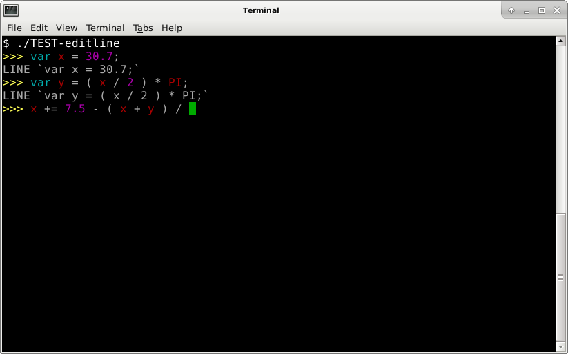

# TCLibs

**License: Dual-licensed [CC0](https://creativecommons.org/publicdomain/zero/1.0/) and [Boost](http://www.boost.org/users/license.html)** (pick one)

A set of single-file public domain libraries done in the spirit of the [stb libraries](https://github.com/nothings/stb).

Note that some of the libraries have dependencies. For a quick reference see the "`DEPENDS:`" line near the top of each file.

The following libraries are currently available (*all are currently* ***alpha version***). The prefix ("`tc_`") is subject to change until stable release.

| Library       | Version | Description                                                        | Dependencies                       |
|:--------------|:--------|:-------------------------------------------------------------------|:-----------------------------------|
| tc_string.h   | -.-.-   | String utility functions. *(may be removed if merged)*             |                                    |
| tc_terminal.h | -.-.-   | System terminal (console) abstraction layer (colors, cursor, ...). |                                    |
| tc_history.h  | -.-.-   | Line history handling; independent of system terminal.             | tc_string                          |
| tc_editline.h | -.-.-   | Terminal line input with history handling.                         | tc_terminal tc_history / tc_string |
| tc_random.h   | -.-.-   | Random number generation. *(very unstable API)*                    |                                    |
| tc_hash.h     | -.-.-   | Cryptographic hash function library.                               |                                    |

Target OSes are Windows, Linux, FreeBSD and Mac OS X. Note that I do not currently have access to OS X, so the code might be buggier than usual.

## Planned and WiP Libraries:

- `tc_vfs.h` (WiP): Virtualized filesystem with directory+zip support (will either use [miniz](https://github.com/richgel999/miniz), or [because miniz has issues and is unmaintained] a custom `tc_[un]zip.h`).

## Screenshots:

Editline:

